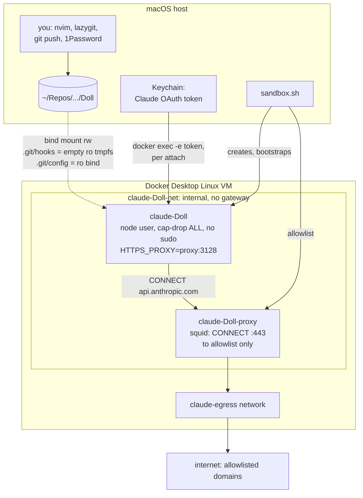
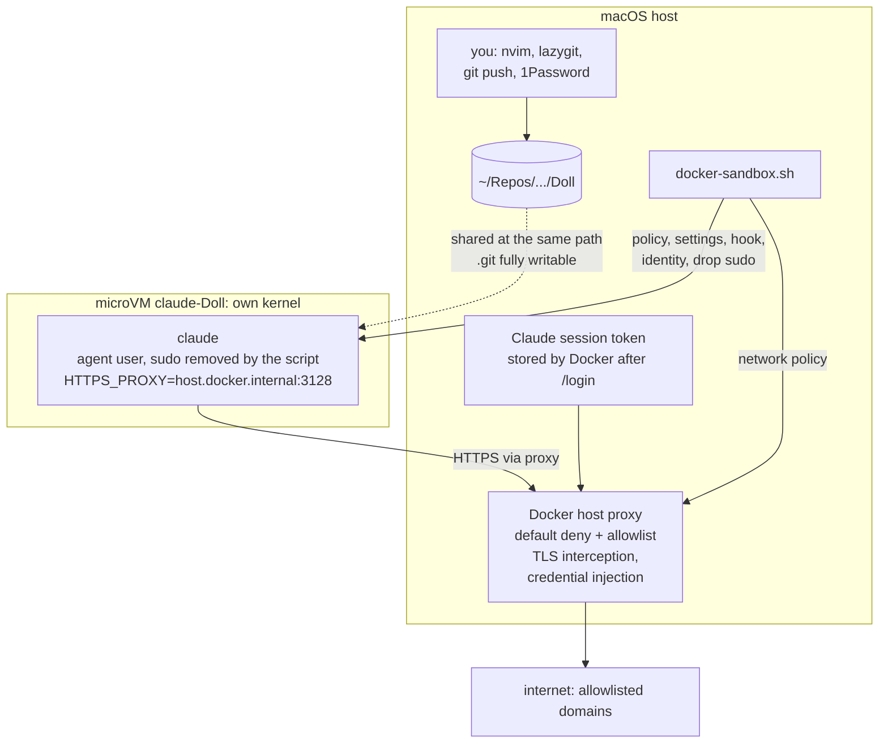
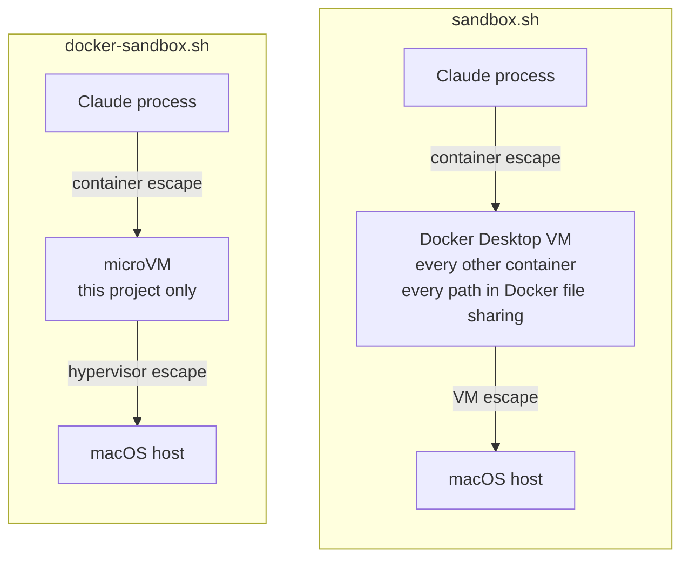
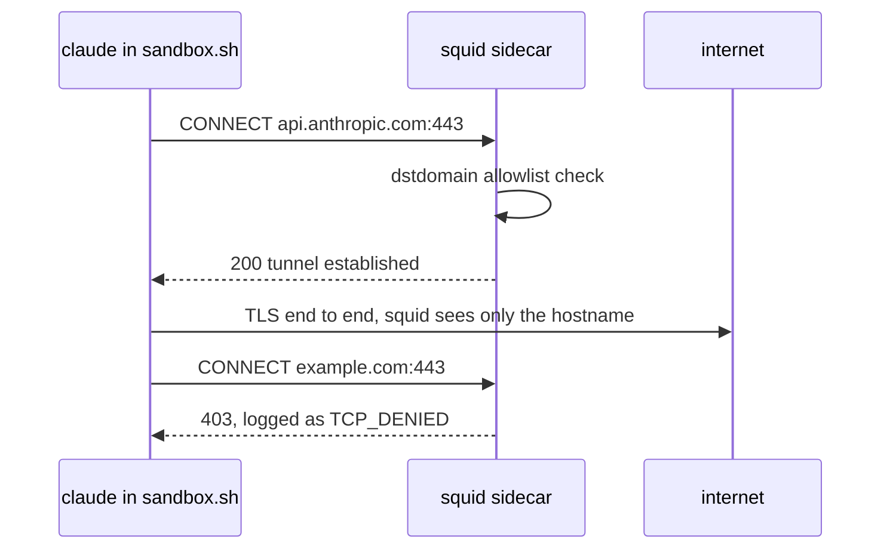
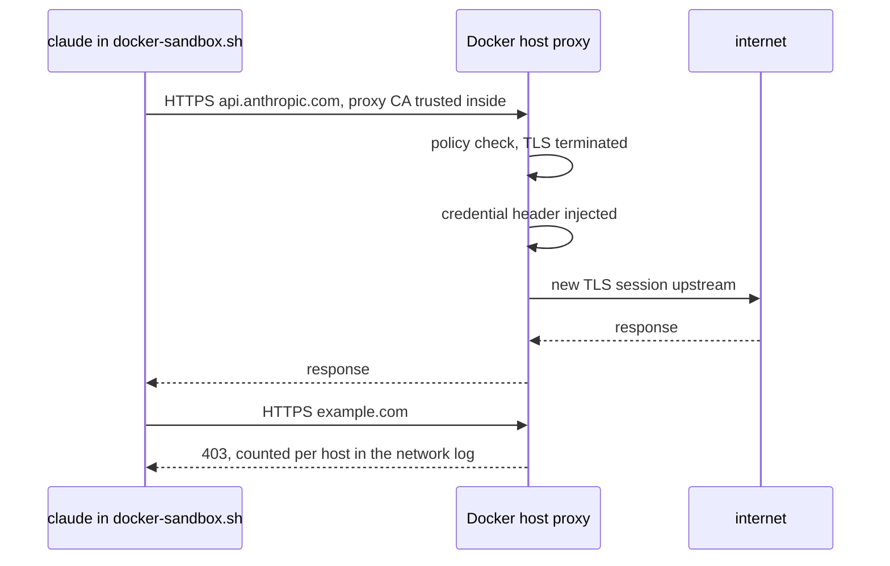
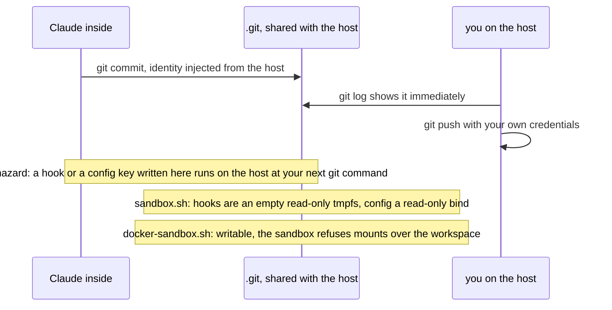
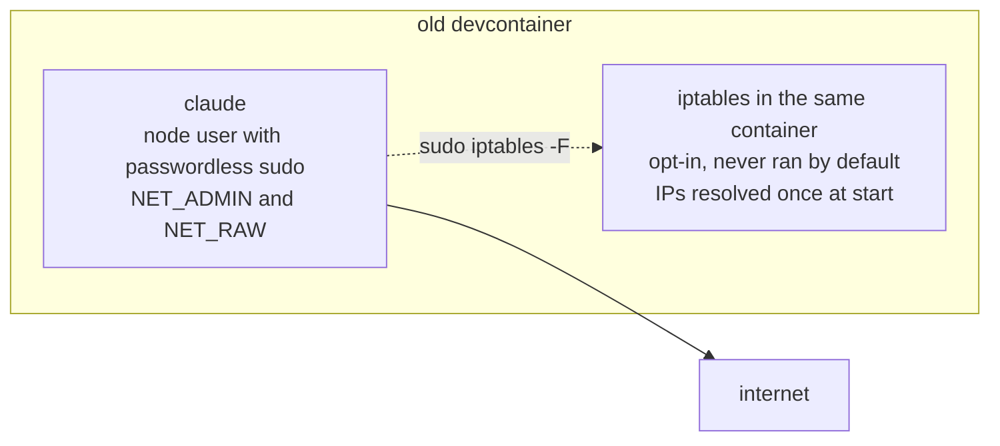

# Claude Code sandboxes: how the two setups differ

Both scripts in this directory run Claude Code against a repo you keep
working on from the host with nvim, lazygit and your own credentials. They
answer different questions:

- `sandbox.sh` answers *what is the agent allowed to do?* It is policy inside
  a container you control completely.
- `docker-sandbox.sh` answers *what if the agent fully compromises its
  environment?* It is a microVM boundary with the credential kept outside.

Everything below was verified on 2026-09-24 with Docker Desktop 29.x and the
`docker sandbox` plugin v0.12.

## 1. Topology

### sandbox.sh: container plus proxy sidecar

The sandbox has no route to the internet at all. The only thing it can reach
is the proxy, and the proxy owns the allowlist. Nothing running inside can
widen it, because there is no sudo, no capability and no iptables to touch.

### docker-sandbox.sh: microVM plus Docker's host proxy

Docker ships this with an allow-all policy, passwordless root, a Docker
daemon inside and Claude in bypassPermissions mode. The script replaces all of
that with the same allowlist, settings and privileges sandbox.sh has, so the
remaining differences are the ones Docker's design forces.

## 2. Where a compromise ends up

Both need two escapes to reach macOS. The difference is what the first one
lands in. In sandbox.sh that is a kernel shared with everything else you run
in Docker, plus whatever file sharing exposes, which is all of /Users unless
you narrow it. In the microVM it is a kernel that holds nothing but this
project.

## 3. What an outbound request goes through

The squid path never decrypts anything and logs every CONNECT. Docker's path
decrypts everything, which is what lets it inject the credential so the token
never exists inside, and logs counts per host rather than requests.

## 4. The commit workflow and the .git hazard

This is the one place where sandbox.sh is stronger for the way you work. In
the Docker sandbox the only thing between Claude and a planted hook is the
permission prompt, plus the Edit and Write deny rules under `.git` in
settings.json.

## 5. Side by side

| | sandbox.sh | docker-sandbox.sh |
| --- | --- | --- |
| Boundary | container, cap-drop ALL, shared VM kernel | microVM with its own kernel |
| First escape lands in | Docker Desktop VM | this project's VM |
| Egress enforcement | squid sidecar on an internal network | Docker host proxy |
| Traffic visibility | hostnames only, no decryption | full decryption via injected CA |
| Allowlist | yours alone | yours, Docker's built-ins blocked by port |
| Claude credential | host OAuth token as env var, per attach | `/login` once, token kept on the host |
| Token reachable by a prompt-injected command | yes, usable only against allowed hosts | no |
| `.git/hooks` and `.git/config` | masked read-only | writable |
| Root inside | none | removed by the script, Docker grants it |
| Permissions | prompts, git push and WebSearch denied | same settings applied |
| Audit | every CONNECT plus every tool call | per-host counters plus every tool call |
| Startup | seconds, instant reuse | about 20 s to create, seconds to reuse |
| Dependencies | Docker Desktop | Docker Desktop with the sandbox plugin |
| Lines you own | about 600 | about 200 on top of Docker's product |

## 6. Before: the devcontainer this replaced

The enforcement point lived inside the thing being sandboxed, so one command
removed it. Both new setups move enforcement outside the agent's reach.

## 7. Which one when

- **Daily interactive work on private repos**, committing inside and pushing
  from the host: sandbox.sh. The `.git` masks, the tight allowlist you own and
  the request-level log matter more than the VM boundary while you are
  watching.
- **Unattended runs, untrusted code, tasks that need Docker or root inside,
  or a credential the agent must use but must never hold**: docker-sandbox.sh.
  The VM boundary and proxy-side credentials are exactly what you want when
  nobody is watching or the code is not yours.
